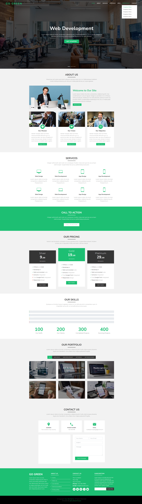

# IT Company Website

A modern and responsive website for an IT company, showcasing their services, projects, and team.

## Features

- Responsive design for all devices
- Services section with detailed descriptions
- Portfolio/Projects showcase
- Team members section
- Contact form

## Screenshot



## Getting Started

To get a local copy up and running follow these simple steps.

### Prerequisites

- A web browser

### Installation

1. Clone the repo
   ```sh
   git clone https://github.com/Muhammad-Shahryar1/it-company.git
   ```
2. Open `index.html` in your browser.

## Technologies Used

- HTML5
- CSS3
- JavaScript